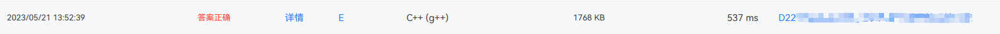
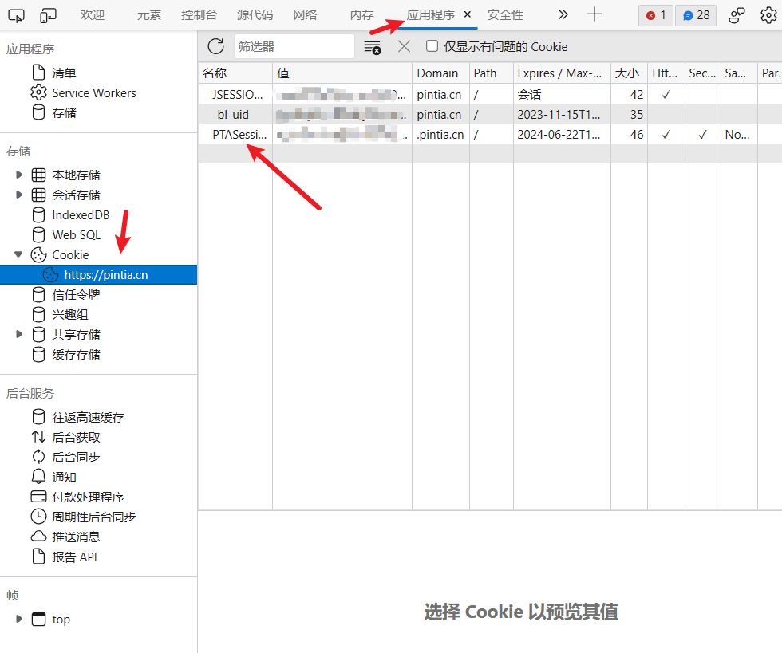

# 使用说明

本程序在2023年河北省省赛中使用

本程序从PTA榜单中爬取比赛队伍过题的情况（如果你有PTA的榜单API的话，可以跳过本程序了，本程序无API）

并将答案正确的队伍的信息打印出来

志愿者根据该信息可以给过题的队伍发送气球

# 准备工作

## 榜单链接

[HBCPC2023-第七届河北省大学生程序设计竞赛（正式赛）](https://pintia.cn/problem-sets/1659939214638964736/manage)

省赛的PTA榜单链接如下：

https://pintia.cn/problem-sets/1659939214638964736/manage

**其中中间的一串数字是题目集ID，需要在更改为自己的比赛ID**

有两个文件：`main.py`和`restartMain.py`，需要将这两个文件中的`contest_id`更改为自己的比赛id

## 比赛时间

本程序在进行爬取时设置了一个开始时间戳，每一次爬取都从上次爬取的最后一条数据开始爬取

为了应对爬取时显示正在判定的队伍，程序每隔一段时间将时间戳设置为比赛开始的时间，并将之前漏掉的队伍打印出来。

所以，你需要在运行程序之前将时间改为你比赛的开始时间，注意格式要与我代码中的一致

**具体需要在`main.py`和`restartMain.py`两个文件之中对四个时间进行修改**

## 浏览器

本程序使用python的selenium库进行爬取，我在文件中放入了chrome浏览器的driver，所以如果要直接运行程序，你需要安装chrome，并且本程序使用的chrome版本为113.0.5672.127。

或者你可以自己下载想要使用的浏览器的对应版本的浏览器driver，并替换`chromedriver.exe`

1. 注意在`get_balloon.py`这个文件中将`executable_path = 'chromedriver.exe`这行代码改成你自己的driver路径
2. 同样在`get_balloon.py`这个文件中将`driver = webdriver.Chrome(service=service)`这行代码也改为你使用的浏览器

## 赛场号

需要将赛场号改为你们自己的赛场号

比如我们学校从A到G7个赛场，每个字母都对应一个门牌号，需要你进行修改

在`get_balloon.py`文件的out函数中进行修改

## 数据格式

程序直接爬取的PTA榜单，其中的用户一栏应该可以由老师进行修改，请修改为适合你们的格式（如果修改的话，你可能需要修改程序中间对于字符串处理的逻辑）

我们学校的格式如下图所示

其中用户一栏我们的格式是：

`[赛场号][座位号] 队名`

如`D22 鸡你太美队`

D表示上一部分所说的考场号，22表示该队伍的座位号，座位号都是两位，如01，07，33等

## cookie

需要一个可以查看榜单的账号的cookie

具体需要你用可以看到榜单的账号（我用的我们老师的）登陆上pta

然后按F12找到PTASession这个cookie的值

在`get_balloon.py`之中用你的cookie代替cookie那一行中的value

注意将cookie会过期，你需要保证比赛期间你的这个cookie没有过期

## 打印机

我们使用的打印机是`易联云打印机`，型号为`W1`,它是一个用来打印外卖订单小条的打印机

你需要在`printer.py`之中将  client_id，client_secret，machine_id这三个变量改为你自己的打印机的

如果你要使用自己的打印机，请自行修改`printer.py`文件

# 使用方式

1. 第一次运行运行main.py：`python -u main.py`
   - 会做出两个动作
     1. 将时间戳（cnt.txt）设置为比赛开始的时间
     2. 将存储过题情况的字典（dict.pkl）清空
   - 然后就会开始爬取pta榜单
2. 后边中断的话，运行restartMain.py重新开始运行：`python -u restartMain.py`
   - 这次只重置时间戳，字典不在清空

**注意**

运行期间弹出来的浏览器窗口，是程序正在模拟爬取过程，请不要对该窗口进行任何操作，一切交给程序，否则可能会干扰程序的正常执行

